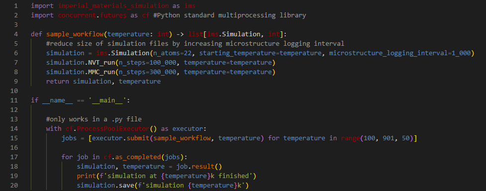
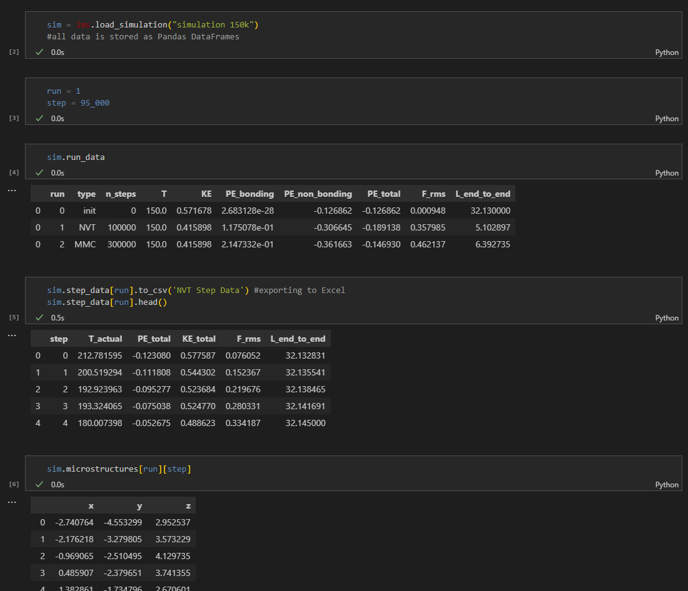

# Imperial Materials Simulation

Molecular simulation tool made for the theory and simulation module taken by materials science and engineering undergraduates at Imperial College London.

It models the forces acting on a molecule in different situations and displays the results live using an interactive Jupyter notebook dashboard.

See the docs folder for the **Quick Start Guide**.

## Method

Each polymer is a linear string of beads (CH2 units) with no side chains. Bonds are modelled as springs and long range interactions are modelled using a 12-6 Lennard-Jones potential.

Four methods of atomistic simulation are implemented: 

1. Steepest descent structural relaxation / energy minimization.

2. Constant temperature ('NVT') dynamics with a Langevin thermostat. 

3. Constant energy Hamiltonian ('NVE') molecular dynamics.

4. Metropolis Monte Carlo ('MMC') stochastic model.

For each time step, the forces and potentials of each atom are calculated. This allows for their positions and velocities to be updated following the given atomistic simluation method.

## Installation

This library can be installed from pypi:

    pip install imperial-materials-simulation

This requires at least Python 3.9.

## Usage

All examples shown can be found in the examples notebook.

All functionality and details are well documented in the doc-strings of the main Simulation class and its methods. 

*Minimal use*

*Data collection*

*Detailed Analysis*

## Support

If you encounter any problems, please create an issue on the [GitHub issue tracker](https://github.com/AyhamSaffar/imperial-materials-simulation/issues). I will endevour push a fix to PyPI as soon as I can.

Community contributions are also welcome. Feel free to create a pull request if you have implemented a bug fix or a feature.

## Development Workflow

Download the repo.

    git clone https://github.com/AyhamSaffar/imperial-materials-simulation.git

Install [uv](https://docs.astral.sh/uv/):

    winget install --id=astral-sh.uv  -e
    
or

    curl -LsSf https://astral.sh/uv/install.sh | sh

Create environment

    uv sync

Run code

    uv run "scripts/Data Collection.py"

Jupyter notebooks can be run by selecting the Python interpreter in the newly created .venv folder.

## Roadmap

The following features could be implemented down the road following popular demand:

- Replace MatPlotLib graphs in display with Plotly for a faster & more responsive dashboard (especially when its live updating during longer runs).

- Add run .xyz trajectory exporter for better integration with external software.

- Added support for charged functional groups on the simulated molecule and a VRORV integrator to better account for the added electrostatic forces.

- Add artist to run dataframe on dashboard so numbers are displayed in scientific format and the row for the current run gets highlighted.

- Add arguements to the .display method to allow for changing the colour and style of the 3D rendered molecule.

## Authors and Acknowledgment

This program was written by me, Ayham Al-Saffar, based on Paul Tangney's initial codebase and was funded by an Imperial College London Student Shapers grant.